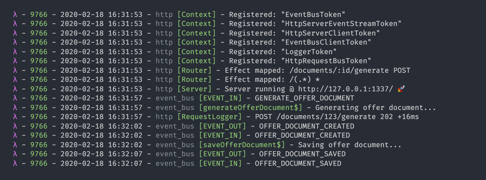

# Logging

## Overview

`@marblejs/core` defines a pluggable **Logger** dependency registered by default to the context of every server factory. Having that you can inspect things like, registered context dependencies, mapped HTTP routes, request/response logs, I/O event traces, etc.



## Logger

The interface allows you to define the log tag, type, main message and an optional level, which if not defined defaults to `LoggerLevel.INFO`.

```typescript
{
  tag: 'event_bus',
  type: 'saveOfferDocument$',
  message: 'Saving offer document...',
  level: LoggerLevel.INFO
}
```

```typescript
enum LoggerLevel { INFO, WARN, ERROR, DEBUG, VERBOSE };

interface LoggerOptions = {
  tag: string;
  type: string;
  message: string;
  level?: LoggerLevel;
};
```

Marble.js logger is an instance of IO monad which represents a synchronous effectful computation. In order to execute the logger you have to "run the `IO` action".

```haskell
Logger :: LoggerOptions -> IO<void>;
```

```typescript
import { LoggerTag, LoggerToken, LoggerLevel, useContext } from '@marblejs/core';
import { r } from '@marblejs/http';
import { requestValidator$, t } from '@marblejs/middleware-io';
import { tap } from 'rxjs/operators';
import { UserDto } from './user.dto';

const foo$ = r.pipe(
  r.matchPath('/foo'),
  r.matchType('GET'),
  r.useEffect((req$, ctx) => {
    const logger = useContext(LoggerToken)(ctx.ask);

    const logMagic = logger({
      tag: LoggerTag.HTTP
      level: LoggerLevel.INFO,
      type: 'foo$',
      message: 'Here the magic happens...',
    });
            
    return req$.pipe(
      tap(logMagic),
      // ..
    ));
  });
```

## Custom logger

You can override the binding and map the stdout IO operations to a different destination \(e.g. file or external service\) when needed.



```typescript
import * as O from 'fp-ts/lib/Option';
import { pipe } from 'fp-ts/lib/function';
import { Logger, LoggerLevel, createReader } from '@marblejs/core';
import { CustomLogger } from './customLogger';

export const CustomLoggerReader = createReader<Logger>(() => opts => {
  const tag = opts.tag;
  const level = opts.level ?? LoggerLevel.INFO;
  const message = `${opts.type} ${opts.message}`;
  const log = pipe(
    O.fromNullable({
      [LoggerLevel.ERROR]: CustomLogger.error,
      [LoggerLevel.INFO]: CustomLogger.log,
      [LoggerLevel.WARN]: CustomLogger.warn,
    }[level),
    O.getOrElse(() => CustomLogger.log),
  );

  return () => log({ tag, message });
});
```



Then in your server definition you have to override the binding.

```typescript
import { bindTo, LoggerToken } from '@marblejs/core';
import { createServer } from '@marblejs/http';
import { CustomeLoggerReader } from './logger.reader.ts';

const server = createServer({
  // ...
  dependencies: [
    bindTo(LoggerToken)(CustomLoggerReader),
  ],
});
```

