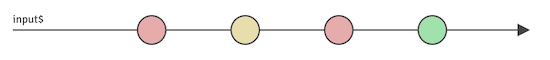
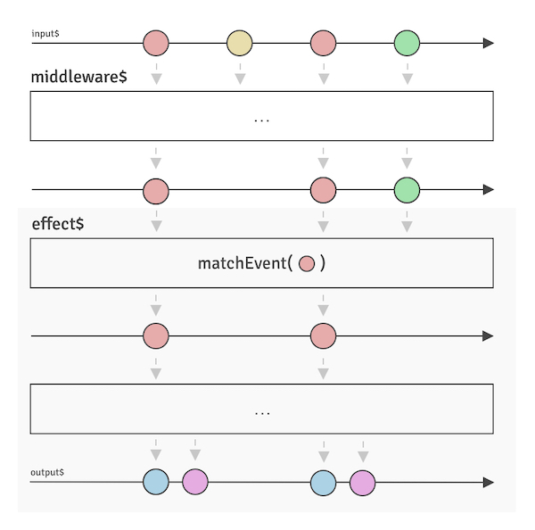

# Effects

Marble.js messaging mental model represents incoming notifications as a stream of Events, that can be emitted either by an independent producer \(client\) or another consumer.



### Processing

The module is built around similar abstractions, like: effect, middleware or output streams. The messaging effect it's just an extension of generic core Effect which is a function that maps a stream of incoming Events to another stream of outgoing Events, thus middleware and output models are a direct equivalent of basic effects.

```haskell
MsgEffect :: Observable<Event> -> Observable<Event>

MsgOutputEffect :: Observable<Event> -> Observable<Event>

MsgMiddlewareEffect :: Observable<Event> -> Observable<Event>
```

`MsgEffect` when compared to their predecessor in form of `HttpEffect` is much more powerful tool, taking the possibilities to the next level. Once you're inside your Effect, use any Observable patterns you desire as long as any output from the final, returned stream, is an Event.



The marble diagram above can be translated into effect code as follows.

```typescript
import { matchEvent } from '@marblejs/core';
import { MsgEffect } from '@marblejs/messaging';
import { mergeMap } from 'rxjs/operators';

const userCreated$: MsgEffect = event$ =>
  event$.pipe(
    matchEvent('USER_CREATED'),
    mergeMap(event => [
      { type: 'SEND_WELCOME_SMS_FOR_USER', payload: event.payload.id },
      { type: 'SEND_WELCOME_EMAIL_FOR_USER', payload: event.payload.id },
    ]),
  );
```

Effects can define the matching against one or more events. Marble.js exposes a [`matchEvent`](../../other/api-reference/core/operator-matchevent.md) operator that is an abstraction over RxJS `filter` operator, with additional functionalities and type-safety underneath.


Keep in mind that messaging effects will always try to emit back the outgoing event. Mapping to  the same input event will cause an infinite loop. You should always map the input event to different event type, or skip emitted values, eg. by `ignoreElements` operator, in case you don't want to output anything.



To learn more about `matchEvent` operator please visit core [API documentation](../../other/api-reference/core/operator-matchevent.md).


### Error handling

Effects are built on top of observable streams provided by RxJS. They are listeners of observable streams that continue until an error or completion occurs. In order for effects to continue running in the event of an error in the observable, or completion of the observable stream, they must be nested within a "flattening" operator, such as `mergeMap`, `concatMap`, `exhaustMap` or other flattening operator. The snippet below shows the example error handling strategy for fetching an author.

```typescript
import { matchEvent } from '@marblejs/core';
import { MsgEffect } from '@marblejs/messaging';
import { of } from 'rxjs';
import { catchError, map, mergeMap } from 'rxjs/operators';
import { pipe } from 'fp-ts/lib/pipeable';

const getUser$: MsgEffect = event$ =>
  event$.pipe(
    matchEvent('GET_USER'),
    mergeMap(event => pipe(
      getUser(event.payload.id),
      map(payload => ({ type: 'GET_USER_RESULT', payload })),
      catchError(error => of({
        type: 'GET_USER_ERROR',
        error: { name: error.name, message: error.message },
      })),
    )),
  );
```


Always remember to catch an error in disposable stream. If not, ****the event stream will be restarted, which means that every already processing event will be lost. Listener will try to resubscribe the stream automatically notifying the developer about the error.


Marble.js defines an [`act`](../../other/api-reference/core/operator-act.md) operator that reduces the required boilerplate to minimum applying the error handling underneath the operator.

```typescript
import { act, matchEvent } from '@marblejs/core';
import { MsgEffect } from '@marblejs/messaging';
import { map } from 'rxjs/operators';
import { pipe } from 'fp-ts/lib/pipeable';

const getUser$: MsgEffect = event$ =>
  event$.pipe(
    matchEvent('GET_USER'),
    act(event => pipe(
      getUser(event.payload.id),
      map(payload => ({ type: 'GET_USER_RESULT', payload })),
    )),
  );
```


To learn more about `act` operator please visit core [API documentation](../../other/api-reference/core/operator-act.md).


### Replying

The previous example shows an effect that produces `GET_USER_RESULT` event without replying to producer. As mentioned in [previous chapter](events.md), event interface defines two additional metadata attributes: `replyTo` and `correlationId`. Typically when dealing with RPC \(request-response\) messaging, the event handler \(effect\) has to reply in case of success or error. In order to do that, effect has to combine the mapped outgoing event with incoming event metadata, passing the information about the **correlation id** that the producer will look for and the **reply channel** where the outgoing event should be routed to.

```typescript
import { act, matchEvent } from '@marblejs/core';
import { reply, MsgEffect } from '@marblejs/messaging';
import { map } from 'rxjs/operators';
import { pipe } from 'fp-ts/lib/pipeable';

const getUser$: MsgEffect = event$ =>
  event$.pipe(
    matchEvent('GET_USER'),
    act(event => pipe(
      getUser(event.payload.id),
      map(payload => ({
        type: 'GET_USER_RESULT',
        payload,
        metadata: e.metadata, // { correlationId, replyTo }
      })),
    )),
  );
```

Again, in order to make the event processing more descriptive and easier to understand, Marble.js defines a [`reply`](../../other/api-reference/messaging/reply.md) function that makes the mapping more explicit.

```typescript
import { act, matchEvent } from '@marblejs/core';
import { reply, MsgEffect } from '@marblejs/messaging';
import { map } from 'rxjs/operators';
import { pipe } from 'fp-ts/lib/pipeable';

const getUser$: MsgEffect = event$ =>
  event$.pipe(
    matchEvent('GET_USER'),
    act(event => pipe(
      getUser(event.payload.id),
      map(payload => reply(event)({ type: 'GET_USER_RESULT', payload })),
    )),
  );
```


To learn more about `reply` function please visit messaging [API documentation.](../../other/api-reference/messaging/reply.md)



When replying to an incoming event, remember to define a different event type than the origin one. In some specific use cases there is a high risk that an emitted command \(non RPC message\) will produce an infinite loop.


